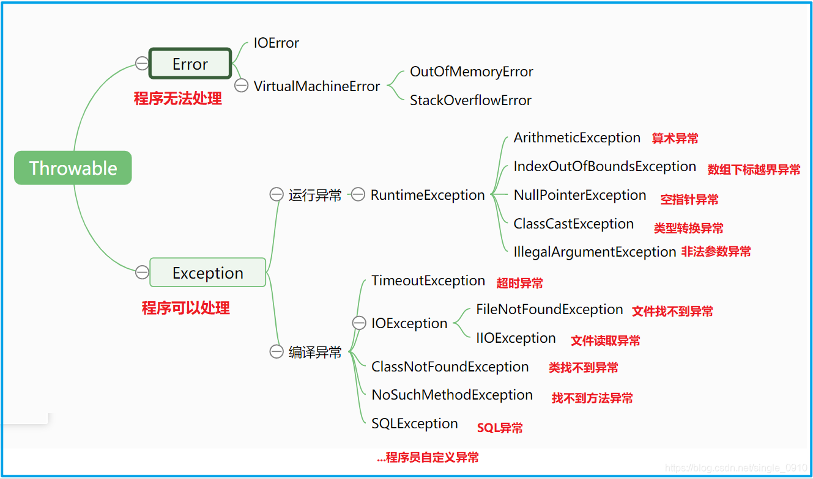

- 为什么要写异常？

要知道c语音是没有这种java的异常体系的，但c语言任何软件都可以写出来

```java
boolean register(string username,string pwd){
    
}
```

上面的设计，任何注册不成功的情况，都只能返回false，调用者就不知道真正的原因。有时是需要知道真正的原因，那么方法的设计就必须更改

```java
int register(string username,string pwd){
    
}
```

这种设计之后，就人为编制一份文档，记录各个不同返回值的含义，比如1表示成功，100表示用户名被占用了，101表示密码不符合规范

这种可以解决问题，但缺陷是代码与文档要同步维护，通常会出现不一致的情况，还有一种就是代码不直观，不容易理解

```java
if (result == 100){
    alert('用户名已经被使用了');
}else if(result == 102){
    alert('密码');
}
```

所以后面编程语言就改变了这种数字型的处理逻辑，改成类型化的处理逻辑

```java
boolean register(string username,string pwd){
   ...
    throw new UserExistExeption();
    ...
    throw new PasswordIsInvalid();
}
```

上面写法时既能通过逻辑判断出注册是否成功，也可以通过抛出异常让调用者知道出错的原因，之后调用者就可以处理

```java
try{
    register()
}catch(UserExistException uee){
    alert('换一个名字')
}catch(PaswordIsInvalid pii){
    alert('换密码')
}
```

- 怎么抛？

在方法里面用throw来抛异常

```java
throw new XxxException();
```

- 抛什么异常呢？

  java的异常分为两类，一个是Error，一个是Exception，Exception继续分为两类，一个是运行时异常，一个是检查异常

  - Error异常一般是虚拟机出现，我们程序员基本不会使用，表示错误，出现了你也解决不了，等着重启程序或者只能等死。比如出现内存不足这种错误

  - 编译异常也叫（检查异常，也叫checked异常）




- 运行时异常与检查异常

​	如果方法内部抛出的是一个RuntimeException，那么方法的签名是不需要throws语句的，比如下面

```java
   public void m1(){
        throw new ArithmeticException("算术运算出错");
    }
```

​	运行时异常特点：方法内部随便抛，方法签名上可以没有throws，调用此方法时也不需要去理会

如果抛出的是一个检查异常，比如

```java
 public void m2(){
        throw new FileNotFoundException("文件找不到");
    }
```

检查异常就是要在写代码的时候检查，也就是在编译的时候要处理，处理有两种逻辑：要么继续抛出，让别人处理，要么自己处理

比如，下面的就是自己处理掉这个抛出的异常

```java
public void doSth(){
    try {
        throw new FileNotFoundException("文件找不到");
    } catch (FileNotFoundException e) {

    }
}
```

要么就继续抛

```java
  public void doSth() throws FileNotFoundException{
        throw new FileNotFoundException("文件找不到");
    }
```

检查异常特点：内部可能抛了一个检查异常，要么自己处理掉，要么继续抛，继续抛就会改变方法的签名，要有throws

- 怎么捕获异常

捕获是用catch语句来实现，可以有多个catch，是有层次关系的，父类异常出现在后面的catch里，真出了异常，只要找到一个符合的catch就完了

```java
 try {
            new C().m1();
        } catch (ArithmeticException ae) {
            System.out.println("算术出错");
        } catch (IndexOutOfBoundsException iobe) {
            System.out.println("index");
        }catch (RuntimeException re){
            System.out.println("runtime");
        }
```

try块不能单独存在，try必须与catch一起，或与finally一起，或与catch，finally三者一起

一个方法出了异常，调用链上没有任何地方处理，程序就结束，后面的代码不执行，比如下面

```java
new C().m1();
System.out.println("end---");
```

所以，上面的最后一行代码在m1出异常时是不执行，不出异常时是会执行的。所以finally代码块就有意义


- 为什么有时捕获了异常又重新抛出？

  为了让上层代码知道发生了什么情况，或者是为了换一个其他的异常抛出，比如下面的QueryRunner的insert方法是抛出一个检查异常，这里捕获之后抛出一个运行时异常

  ```java
  private QuerryRunner runner = ....
  	
  public int insert(){
  
      try{
          runner.insert()
      }catch(SQLException e){
          throw new RuntimeException("sql执行出错");
  
      }
  }
  ```

  