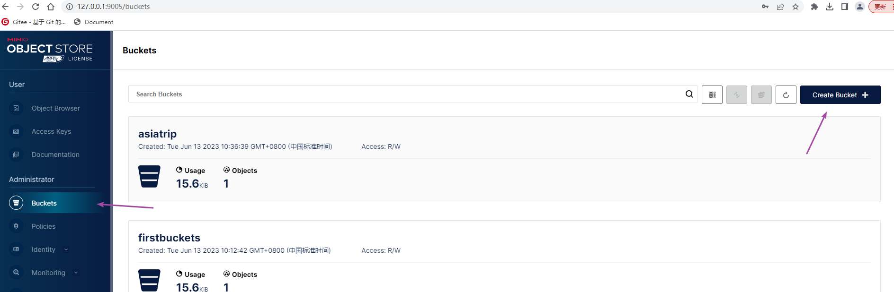
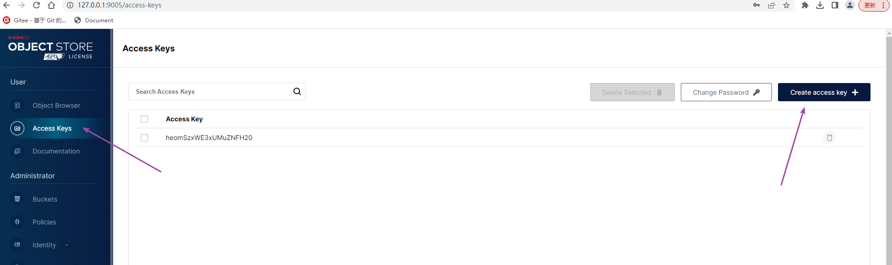

# 简介

MinIO 提供高性能、与S3 兼容的对象存储系统，让你自己能够构建自己的云储存服务。

MinIO原生支持 Kubernetes，它可用于每个独立的公共云、每个 Kubernetes 发行版、私有云和边缘的对象存储套件。
MinIO是软件定义的，不需要购买其他任何硬件，在 GNU AGPL v3 下是 100% 开源的。其官方中文网址是：https://www.minio.org.cn/

Minio 是个基于 Golang 编写的开源对象存储套件，虽然轻量，却拥有着不错的性能。类似的技术有fastdfs，都是业界不错的分布式文件存储系统

> 有一个玩具级别的支持http的ftp软件hfs，可以用在教学中

## 对象存储

何为对象存储？我们来看下`阿里云 OSS` （Object Storage Service）的介绍：

> 对象存储服务（Object Storage Service，OSS）是一种海量、安全、低成本、高可靠的云存储服务，适合存放任意类型的文件。容量和处理能力弹性扩展，多种存储类型供选择，全面优化存储成本。

对于中小型企业，如果不选择存储上云，那么 Minio 是个不错的选择，麻雀虽小，五脏俱全。当然 Minio 除了直接作为对象存储使用，还可以作为云上对象存储服务的网关层，无缝对接到 Amazon S3、MicroSoft Azure。

## 学习资料

在其官网的导航栏上有"文档"一栏，这里可以找到学习资料，网址是:https://www.minio.org.cn/docs/minio/windows/index.html

> 注意：本文主要是针对windows系统上的使用编写的，但实际上产品级应用的话，minio应该是部署运行在linux上的，所以本文的一些内容在linux上可能不太适用

## 下载

在官网的首页的右上角有下载的链接可以点击，请下载对应os系统的版本，本文下载的是windows版本的，下载的网址为：https://www.minio.org.cn/download.shtml#/windows，只需要下载`minio server`即可， `minio client`是可以不用下载的

## 部署运行

Minio 提供了两种部署方式：单机部署和分布式，两种部署方式都非常简单，其中分布式部署还提供了纠删码功能来降低数据丢失的风险。下面主要采用的是单机部署的方式

- 进入到你下载的minio server的目录，运行命令行终端
- 可选的设置minio运行时使用的账号密码
- 指定minio运行过程中使用过的数据目录（不要求这个目录预先存在）
- 指定minio运行时使用的端口

```shell
-- 下面是指定账号与密码，账号长度必须是3位以上，密码是8位以上
set MINIO_ROOT_USER=admin
set MINIO_ROOT_PASSWORD=12345678
C:\minio.exe server F:\Data --console-address ":9001"
```


> 环境变量https://www.cnblogs.com/springsnow/p/12610417.html

具体情况如下

```shell
E:\tools\minio>set MINIO_ROOT_USER=admin
E:\tools\minio>set MINIO_ROOT_PASSWORD=12345678

E:\tools\minio>minio.exe server c:/data --console-address ":9005"
MinIO Object Storage Server
Copyright: 2015-2023 MinIO, Inc.
License: GNU AGPLv3 <https://www.gnu.org/licenses/agpl-3.0.html>
Version: RELEASE.2023-06-09T07-32-12Z (go1.19.9 windows/amd64)

Status:         1 Online, 0 Offline.
S3-API: http://169.254.72.151:9000  http://172.16.8.75:9000  http://192.168.197.1:9000  http://192.168.44.1:9000  http://127.0.0.1:9000
RootUser: admin
RootPass: 12345678

Console: http://169.254.72.151:9005 http://172.16.8.75:9005 http://192.168.197.1:9005 http://192.168.44.1:9005 http://127.0.0.1:9005
RootUser: admin
RootPass: 12345678

Command-line: https://min.io/docs/minio/linux/reference/minio-mc.html#quickstart
   $ mc.exe alias set myminio http://169.254.72.151:9000 admin 12345678

Documentation: https://min.io/docs/minio/linux/index.html
Warning: The standard parity is set to 0. This can lead to data loss.
```

启动服务端之后，可以在浏览器上输入http://127.0.0.1:9005来访问minio的控制台,输入账号admin，密码12345678就可以使用它了

# 核心操作

## 创建Buckets(桶)

在下图所示的地方创建桶



## 创建AccessKey



# java操作minio

网址https://min.io/docs/minio/linux/developers/java/minio-java.html有一个代码示例，我把其改为读取windows下的一个文件并上传到官网提供的服务器上了

```java
 public static void main(String[] args)
      throws Exception {
    try {
        
      // Create a minioClient with the MinIO server playground, its access key and secret key.
      MinioClient minioClient =
          MinioClient.builder()
              .endpoint("https://play.min.io")
              .credentials("Q3AM3UQ867SPQQA43P2F", "zuf+tfteSlswRu7BJ86wekitnifILbZam1KYY3TG")
              .build();

      boolean found =
          minioClient.bucketExists(BucketExistsArgs.builder().bucket("asiatrip").build());
      if (!found) {
  minioClient.makeBucket(MakeBucketArgs.builder().bucket("asiatrip").build());
      } else {
        System.out.println("Bucket 'asiatrip' already exists.");
      }

      // Upload '/home/user/Photos/asiaphotos.zip' as object name 'asiaphotos-2015.zip' to bucket
      // 'asiatrip'.
      minioClient.uploadObject(
          UploadObjectArgs.builder()
              .bucket("asiatrip")
              .object("1.jpg")
              .filename("e:/image/1.jpg")
              .build());
      System.out.println(
          "'e:/image/1.jpg' is successfully uploaded as "
              + "object '1.jpg' to bucket 'asiatrip'.");
    } catch (MinioException e) {
      System.out.println("Error occurred: " + e);
      System.out.println("HTTP trace: " + e.httpTrace());
    }
  }
```

运行上面的代码后可以访问网址https://play.min.io  输入账号Q3AM3UQ867SPQQA43P2F，密码zuf+tfteSlswRu7BJ86wekitnifILbZam1KYY3TG就可以在`asiatrip`这个bucket里面看到刚上传的1.jpg文件

上面的代码重复运行是没有问题的，相当于覆盖，不会上传很多个文件。

在网址https://min.io/docs/minio/linux/developers/java/API.html里面有各个API的简单说明，https://minio-java.min.io/这是是API文档，在https://github.com/minio/minio-java/tree/release/examples这里有一些示例代码

依据上面的代码示例，你可以在你本地的minio进行文件上传的操作，示例代码如下

```java
 try {
      // Create a minioClient with the MinIO server playground, its access key and secret key.
      MinioClient minioClient =
          MinioClient.builder()
              .endpoint("http://127.0.0.1:9000")
              .credentials("heomSzxWE3xUMuZNFH20", "P1chfRwfrdIo4hSApUolfrekFFzYUiCjUE7qeec4")
              .build();

      boolean found =
          minioClient.bucketExists(BucketExistsArgs.builder().bucket("firstbuckets").build());
      if (!found) {
 minioClient.makeBucket(MakeBucketArgs.builder().bucket("firstbuckets").build());
      } else {
        System.out.println("Bucket 'firstbuckets' already exists.");
      }

//uploadObject:Uploads data from a file to an object(从一个文件中上传数据为minio的对象).
      minioClient.uploadObject(
          UploadObjectArgs.builder()
              .bucket("firstbuckets")
              .object("1.jpg")
              .filename("e:/image/1.jpg")
              .build());
      System.out.println(
          "'e:/image/1.jpg' is successfully uploaded as "
              + "object '1.jpg' to bucket 'firstbuckets'.");
    } catch (MinioException e) {
      System.out.println("Error occurred: " + e);
      System.out.println("HTTP trace: " + e.httpTrace());
    }
```

## 流的形式上传

```java
InputStream inputStream = new FileInputStream("e:/image/2.jpg");
    try {
      // Create a minioClient with the MinIO server playground, its access key and secret key.
      MinioClient minioClient =
              MinioClient.builder()
                      .endpoint("http://127.0.0.1:9000")
                      .credentials("heomSzxWE3xUMuZNFH20", "P1chfRwfrdIo4hSApUolfrekFFzYUiCjUE7qeec4")
                      .build();

      // Make 'asiatrip' bucket if not exist.
      boolean found =
              minioClient.bucketExists(BucketExistsArgs.builder().bucket("firstbuckets").build());
      if (!found) {
        // Make a new bucket called 'asiatrip'.
        minioClient.makeBucket(MakeBucketArgs.builder().bucket("firstbuckets").build());
      } else {
        System.out.println("Bucket 'firstbuckets' already exists.");
      }

//putObject:Uploads data from a stream to an object((从一个流中上传数据为minio的对象)).
      minioClient.putObject(
              PutObjectArgs.builder()
                      .bucket("firstbuckets")
                      .object("2.jpg")
                      .stream(inputStream,inputStream.available(),-1)
                      .build());
      System.out.println(
              "'e:/image/2.jpg' is successfully uploaded as "
                      + "object '2.jpg' to bucket 'firstbuckets'.");
    } catch (MinioException e) {
      System.out.println("Error occurred: " + e);
      System.out.println("HTTP trace: " + e.httpTrace());
    }finally {
      inputStream.close();
    }
```

## 下载文件

```java
MinioClient minioClient =
    MinioClient.builder()
    .endpoint("http://127.0.0.1:9000")
    .credentials("heomSzxWE3xUMuZNFH20", "P1chfRwfrdIo4hSApUolfrekFFzYUiCjUE7qeec4")
    .build();
//获取要下载文件的输入流
InputStream inputStream = minioClient.getObject(GetObjectArgs.builder().bucket("firstbuckets").object("1.jpg").build());

try (InputStream in = this.inputStream; OutputStream out = resp.getOutputStream()) {
    int byteCount = 0;
    byte[] buffer = new byte[BUFFER_SIZE];
    int bytesRead;
    while ((bytesRead = in.read(buffer)) != -1) {
        out.write(buffer, 0, bytesRead);
        byteCount += bytesRead;
    }
    out.flush();
}
```


# 参考资料

https://www.cnblogs.com/lvlinguang/p/15774612.html

https://juejin.cn/post/7119788812640714782

https://juejin.cn/post/7041472195540811783
