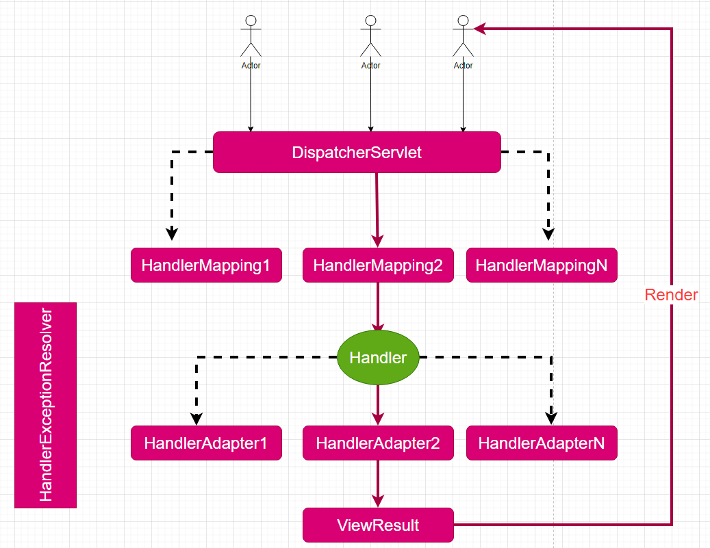

# 说明

- 此框架教学用
- 尽量接近spring mvc，也会参考asp.net mvc与struts，比如命名尽量一样
- 暂不考虑线程安全性(TODO：后续处理)
- 尽量体现框架的灵活性

# 功能目标

- HandlerMapping
- HandlerAdapter
- ViewResult
- HandlerInterceptor与HandlerExecutionChain
- HandlerMethodArgumentResolver
- HandlerExceptionResolver
- 静态资源处理（Default Servlet）
- 文件上传下载
- cors

# 框架结构



# DispatcherServlet

前端总控器也叫前端控制器

> response.sendError(HttpServletResponse.SC_NOT_FOUND);

# HandlerMapping

Handler就是后端控制器，由用户编写，真正负责请求的处理

什么是一个Handler完全由HandlerMapping去决定，去查找，框架并不限定，比如下面这些都可以认为是一个Handler

- 普通的类
- 实现了某个接口的类
- 添加了某个注解的类
- 以某个名字结尾的类


## 类扫描

类扫描是用来扫描各种类型，比如HandlerMapping，HandlerAdapter，控制器类（Handler）等

## HandlerInfo

扫描到的Handler用此类封装，鉴于此类可以给不止一个HandlerMapping使用，所以不与某个具体的HandlerMapping放在同一个包下

## NameConventionHandlerMapping

设计这个类，主要是想快速的实现一个基本可以用的HandlerMapping，此HandlerMapping就是当类的名字以Controller结尾就认为是一个Handler，可以处理的请求就是类的名字去掉controller结尾的地址，比如类名叫FirstController，可以处理的请求地址就是/first

> 这点实现类似于spring mvc中的BeanNameUrlHandlerMapping实现

设计这样的HandlerMapping特别能体现HandlerMapping只负责查找Handler，Handler怎么执行不是HandlerMapping关心的事，那是HandlerAdapter关心的事，因为此HandlerMapping找到了一个Handler之后，此类中那么多方法，该用哪个方法去处理请求呢？方法怎么调用，方法参数该传递什么值呢？统统不用理会

# HandlerAdapter


## HttpRequestHandler

## HttpRequestHandlerAdapter


# ViewResult

## ForwardViewResult

## RedirectViewResult

## HtmlViewResult

## PlainViewResult


## JsonViewResult

## VoidViewResult

handler的方法返回的不是ViewResult时使用，直接response.getWriter.println("返回结果")


## FileViewResult

## HandlerHelper


# RequestMappingHandlerMapping


## RequestMapping注解

注解只修饰在方法上，暂不考虑修饰在类上的情况

## HandlerMethod


# RequestMappingHandlerAdapter

## HandlerMethodArgumentResolver


实现以下功能

- 简单类型，比如string，int等，利用RequestParam注解指定名字
- 简单类型的数组，比如int[] ，利用RequestParam注解指定名字
- 复杂类型，一个bean，利用Model注解
- servlet相关API类型，比如HttpServletRequest，HttpSession，HttpServletResponse，ServletContext

### RequestParam

除非打开parameters编译选项，否则jdk8中普通的反射api是没有办法获取参数名的


> org.springframework.core.convert.TypeDescriptor中有一些有用的工具方法，比如isPrimitive，isArray等
>
> org.springframework.core.DefaultParameterNameDiscoverer 此类可以用来解析参数名

### ServletRequestArgumentResolver


### RequestParamArgumentResolver

解析RequestParam注解


### ModelArgumentResolver

解析Model注解

### RequestBodyArgumentResolver

# 顺序处理

HandlerMapping与HandlerAdapter等的顺序会影响由哪一个实现去处理请求，所以能调整控制其顺序是比较重要的一个功能

## Order注解

## OrderComparator

## Ordered接口（TODO：后续实现）


# 上下文对象

## MvcContext

从此类中只读可以获取所有的HandlerMapping(mappings),HandlerAdapters(adapters),handler的方法的参数解析器（argumentResolvers),异常解析器（exceptionResolvers)

### 只读集合


## HandlerContext

​	此类是一个线程安全的请求上下文对象，记录每次请求的相关对象，比如request与response，以便在任意地方都可以方便的获取这些对象，比如在ViewResult里

```java
public class ActionContext {

	public static final String REQUEST = "edu.cj.request";
	public static final String RESPONSE = "edu.cj.response";
	public static final String SESSION = "edu.cj.session";
	public static final String APPLICATION = "edu.cj.application";
	public static final String PARAMETERS = "edu.cj.parameters";
	public static final String VALUESTACK = "edu.cj.valuestack";

	private Map<String, Object> context;
	public static ThreadLocal<ActionContext> actionContext = new ThreadLocal<ActionContext>();

	//action构造函数
	public ActionContext(HttpServletRequest request, HttpServletResponse response, Object action) {
		context = new HashMap<String, Object>();
		// 准备域
		// request
		context.put(REQUEST, request);
		// response
		context.put(RESPONSE, response);
		// session
		context.put(SESSION, request.getSession());
		// application
		context.put(APPLICATION, request.getSession().getServletContext());
		// parameters
		context.put(PARAMETERS, request.getParameterMap());

		// valuestack,暂时值栈只在ParametersIntercepter中有用。
		ValueStack vs = new ValueStack();
		// 将action压入栈顶
		vs.push(action);
		// 将ValueStack放入request域中
		request.setAttribute(VALUESTACK, vs);
		// 将ValueStack放入context域中
		context.put(VALUESTACK, vs);


		// 把创建好的ActionContext对象放入到threadlocal中
		actionContext.set(this);
	}

	/**
	 * @return 当前线程对应的ActionContext对象
	 */
	public static ActionContext getContext() {
		return actionContext.get();
	}

	public HttpServletRequest getRequest() {
		return (HttpServletRequest) context.get(REQUEST);
	}

	public HttpServletResponse getResponse() {
		return (HttpServletResponse) context.get(RESPONSE);
	}

	public HttpSession getSession() {
		return (HttpSession) context.get(SESSION);
	}

	public ServletContext getApplication() {
		return (ServletContext) context.get(APPLICATION);
	}

	public Map<String, String[]> getParams() {
		return (Map<String, String[]>) context.get(PARAMETERS);
	}

	public ValueStack getValueStack() {
		return (ValueStack) context.get(VALUESTACK);
	}

}
```

# 异常处理

多个异常处理器的处理逻辑是：只要有任意一个异常处理器处理后返回值不为null就不再使用下一个异常处理器了

异常处理的方法与Handler的方法返回类型是一样的，最后都会经过后续的render处理

在当前的设计中，HandlerMapping、HandlerAdapter、render方法抛出的异常都是Exception

## HandlerExceptionResolver接口

## ExceptionHandler注解


# 静态资源处理

## DefaultServletHttpRequestHandler

# 文件处理

## 上传

### MultipartFile


> 参见spring的RequestParamMethodArgumentResolver以及MultipartResolutionDelegate

### StandardMultipartFile

spring的FileCopyUtils与StreamUtils可以直接复制过来使用，比较简单

## 下载（FileViewResult)

`Content-Disposition`

> HttpHeaders.CONTENT_DISPOSITION

# Cors

https://ruanyifeng.com/blog/2016/04/cors.html

跨域过滤器的写法可以参考https://www.cnblogs.com/kendoziyu/p/14735380.html,下面是一个简化写法

```java
public class CrossFilter implements Filter {
    private static final String ORIGIN = "Origin";

    private static final String REFERER = "Referer";

    private static final String TRUE = "true";

    private static final String CACHE_86400 = "86400";

    private static final String ACCESS_CONTROL_ALLOW_ORIGIN = "Access-Control-Allow-Origin";

    private static final String ACCESS_CONTROL_ALLOW_CREDENTIALS = "Access-Control-Allow-Credentials";

    private static final String ACCESS_CONTROL_REQUEST_METHOD = "Access-Control-Request-Method";

    private static final String ACCESS_CONTROL_REQUEST_HEADERS = "Access-Control-Request-Headers";

    private static final String ACCESS_CONTROL_MAX_AGE = "Access-Control-Max-Age";

    private static final String ACCESS_CONTROL_ALLOW_METHODS = "Access-Control-Allow-Methods";

    private static final String ACCESS_CONTROL_ALLOW_HEADERS = "Access-Control-Allow-Headers";

    @Override
    public void init(FilterConfig filterConfig) {
        //do something
    }

    @Override
    public void doFilter(ServletRequest request, ServletResponse response, FilterChain chain) throws IOException, ServletException {
        // 解决跨域请求问题
        HttpServletRequest req = (HttpServletRequest) request;
        HttpServletResponse resp = (HttpServletResponse) response;
        String origin = req.getHeader (ORIGIN);
        if (origin == null) {
            origin = req.getHeader (REFERER);
        }
        // 允许指定域访问跨域资源
        setHeader (resp, ACCESS_CONTROL_ALLOW_ORIGIN, origin);
        // 允许客户端携带跨域cookie，此时origin值不能为“*”，只能为指定单一域名
        setHeader (resp, ACCESS_CONTROL_ALLOW_CREDENTIALS, TRUE);
        if (RequestMethod.OPTIONS.toString ().equals (req.getMethod ())) {
            String allowMethod = req.getHeader (ACCESS_CONTROL_REQUEST_METHOD);
            String allowHeaders = req.getHeader (ACCESS_CONTROL_REQUEST_HEADERS);
            // 浏览器缓存预检请求结果时间,单位:秒
            setHeader (resp, ACCESS_CONTROL_MAX_AGE, CACHE_86400);
            // 允许浏览器在预检请求成功之后发送的实际请求方法名
            setHeader (resp, ACCESS_CONTROL_ALLOW_METHODS, allowMethod);
            // 允许浏览器发送的请求消息头
            setHeader (resp, ACCESS_CONTROL_ALLOW_HEADERS, allowHeaders);
            return;
        }
        chain.doFilter (request, response);
    }

    private void setHeader(HttpServletResponse resp, String key, String value) {
        resp.setHeader (key, value);
    }

    @Override
    public void destroy() {
        //do someThing
    }
}
```


> spring中主要是CrossOrigin注解，CorsConfiguration，CorsProcessor几个类型合作来处理跨域问题，spring的跨域逻辑主要是在AbstractHandlerMapping的getHandler方法中实现的
>
> 当是"预检"请求（preflight）时，就把执行链中的Handler换成PreFlightHandler，如果不是预请求就把CorsInterceptor拦截器添加为拦截链的第一个（不改动原来的handler）
>
> PreFlightHandler与CorsInterceptor的跨域处理都是交给CorsProcessor接口的实现类去处理的


# 配置器（Configurer）

你自己编写的一些组件，比如自定义的HandlerAdapter是不需要进行特殊的配置的，因为整个类都是用户自己编写的，但框架内提供的一些组件有些内容是不能预先就写死的，需要进行灵活的配置，比如spring mvc的SimpleUrlHandlerMapping这样类里面的urlMap映射map的信息

如果仅仅只在文本（比如web.xml中）里面进行配置很不方便，甚至做不到，有时就需要在代码进行额外的配置，在spring mvc中关于配置器的实现逻辑如下

- 有某个类型需要进行动态配置或要由用户配置，比如DefaultServletHttpRequestHandler
- 编写一个配置器类，此类一般不需要继承什么类型，其作用是专门用来对上一步的类型进行一些配置，比如DefaultServletHandlerConfigurer

- spring mvc是通过EnableWebMvc注解来导入配置类DelegatingWebMvcConfiguration，不通过EnableWebMvc注解的话，也可以通过编写一个配置类继承DelegatingWebMvcConfiguration来进行配置

  - 如果某些配置不能写死，用户可以通过实现WebMvcConfigurer接口中的某个方法对这个配置进行定制配置，比如void configureDefaultServletHandling(DefaultServletHandlerConfigurer configurer)方法就是专门对DefaultServletHttpRequestHandler进行配置的

- 在配置类中通过一些Bean方法来注册组件，比如defaultServletHandlerMapping方法来注册一个HandlerMapping

  - 在此方法内，实例化某一个特定的配置器，比如DefaultServletHandlerConfigurer，有了这个配置器之后就可以对特定的某个组件进行配置
  - spring mvc找到所有的WebMvcConfigurer接口的实现类，循环遍历这些实现类（一般只有一个），依次调用配置方法，比如configureDefaultServletHandling，这些方法的实现由用户提供，用户利用此方法提供的参数DefaultServletHandlerConfigurer 进行对DefaultServletHttpRequestHandler的配置，比如用户调用DefaultServletHandlerConfigurer 的enable方法来启用默认servlet来处理请求
  - 调用特定类的配置的某个方法用来得到配置的最终结果，比如调用DefaultServletHandlerConfigurer 的buildHandlerMapping方法得到一个SimpleUrlHandlerMapping对象的bean的注册

  比如案例中的MethodNameHandlerAdapter这个组件，其名字不应该是写死为process，应该可以让用户指定要执行的方法名，大体的思路如下

  第一步：MethodNameHandlerAdapter有方法能设置要调用的方法名，比如下面

  ```java
  public class MethodNameHandlerAdapter implements HandlerAdapter {
      private String methodName;
      
      public void setMethodName(String name){
          this.methodName =  name;
      }
      //supports与handle省略
  }
  ```

  第二步：编写一个专门的配置类MethodNameHandlerAdapterConfigurer

  ```java
  public class MethodNameHandlerAdapterConfigurer{
      private MethodNameHandlerAdapter adapter;
      
      public MethodNameHandlerAdapterConfigurer(MethodNameHandlerAdapter adapter){
          this.adapter = adapter;
      }
      
      public void configMethodName(String name){
          this.adapter.setMethodName(name);
      }
  }
  ```

  第三步：编写一个WebMvcConfigurer接口，里面提供对MethodNameHandlerAdapter的配置能力，比如

  ```java
  public interface WebMvcConfigurer{
      default void configMethodNameHandlerAdapter(MethodNameHandlerAdapterConfigurer configurer){}
  }
  ```

  第四步：在DispatcherServlet类的getDefaultHandlerAdapters中调用configMethodNameHandlerAdapter方法，比如

  ```java
  public class DispatcherServlet{
      private List<WebMvcConfigurer> configurers;
      public List<HandlerAdapter> getDefaultHandlerAdapters(){
           protected List<HandlerAdapter> getDefaultHandlerAdapters() {
          List<HandlerAdapter> adapters = new ArrayList<>();
          adapters.add(new HttpRequestHandlerAdapter());
          HandlerAdapter methodNameAdapter = new MethodNameHandlerAdapter();
               MethodNameHandlerAdapterConfigurer configurer = new MethodNameHandlerAdapterConfigurer(methodNameAdapter);
               for(WebMvcConfigurer mvcConfigurer:configurers){
                   mvcConfigurer.configMethodNameHandlerAdapter(configurer)
               }
                handlerAdapters.add(methodNameAdapter);
          return adapters;
      }
      }
  }
  ```

  

## 另一种实现思路

保留WebMvcConfigurer接口，内容改造为下面这些，其成员主要是可以配置的核心组件，比如HandlerMapping，HandlerAdapter，而不是哪一个具体的组件，比如下面

```java
public interface WebMvcConfigurer{
    default void configHandlerMappings(List<HandlerMapping> handlerMappings){}
     default void configHandlerAdapters(List<HandlerAdapter> handlerAdapters){}
    //...等等其它可以配置的
}
```

用户实现WebMvcConfigurer接口，针对其想配置的具体组件进行配置，比如

```java
public class MyConfigurer implements WebMvcConfigurer{
    public void configHandlerAdapters(List<HandlerAdapter> handlerAdapters){
        for(HandlerAdapter adapter:handlerAdapters){
            if(adapter instanceOf MethodNameHandlerAdapter){
                MethodNameHandlerAdapter adaptee = (MethodNameHandlerAdapter) adapter
                    adaptee.setMethodName("abc");
            }
        }
    }
}
```

这种方案实现简单，但要求对每一个具体组件比较了解，知道该配置那些内容，配置之后有什么影响都需要用户非常清楚，而spring mvc的实现是有专门的配置器来决定哪些可以配置的，具体的配置细节用户不需要知道，由专门配置器内部去处理（想想DefaultServletHandlerConfigurer类的enable方法内部的内容）


# 框架扩展

可以从以下几个方面扩展框架

- 添加自己的HandlerMapping
- 添加自己的HandlerAdapter
- 添加自己的HandlerMethodArgumentResolver
- 添加自己的HandlerExceptionResolver
- 添加自己的ViewResult

## 对象注册

可以在DispatcherServlet的初始化配置中注册，也可以利用Servlet的监听器注册这些扩展组件，也可以利用类扫描的形式注册组件，当然也可以利用SPI技术动态注册组件，在当前实现中使用类扫描的形式来实现，只需要让扩展属性在配置的扫描的包里面（componentScan的值）即可，主要有如下一些扩展类型

- HandlerMapping
- HandlerAdapter
- MethodArgumentResolver
- HandlerExceptionResolver
- ViewResult子类不需要注册，直接在Handler方法的返回类型用上就可以了

## HandlerMapping

在这个扩展里，实现找@Controller注解修饰的类才是控制器，其方法名就对应请求地址的功能，可以考虑就用HandlerMethodHandlerAdapter（此类支持HandlerMethod），也可以考虑实现自己的HandlerAdapter（比如实现对Method的支持，让HandlerMapping把扫描的被Controller修饰的类的方法放置到其内置的容器里，可以简单的让方法只有HttpServletRequest与HttpServletResponse作为参数


# todo和这两天要做的事

- 重构OrderComparator(ok)
- RedirectViewResult和ForwardViewResult (ok)
- DispatcherServlet的render方法去掉if判断，因为Adapter确保返回ViewResult了 ,记得看HandlerAdapter接口的注释，有说明原因（ok）
- ReflectionUtils（ok）
- 把HandlerInfo重命名为HandlerMethod（ok）
- 给HandlerMethod添加Object  instance这样的属性
- 实现RequestMappingHandlerAdapter
- 改了DispatcherServlet类的render方法，在HandlerAdapter接口注释中写了原因（ok）
- 重构了ReflectionUtils的newInstance方法（ok)
- 设置编码（DispatcherServlet的service方法） （ok）
- cors
- 静态资源处理（ok），见DispatcherServlet的noHandlerFound方法
- FileViewResult编写

# 附录

## classgraph

https://mvnrepository.com/artifact/io.github.classgraph/classgraph，在https://www.baeldung.com/classgraph有一个简单的入门教程

The cool thing is that **Classgraph is fast, as it works on the byte-code level**, meaning the inspected classes are not loaded to the JVM, and it doesn't use reflection for processing.（解析字节码文件，没有用反射，也没有把类加载到jvm中）

When we want to instantiate found classes, it's very important to do that not via *Class.forName,* but by using the library method *ClassInfo.loadClass*.（加载类的时候，不要用Class.forName,而要用此库提供的ClassInfo.loadClass方法）

The reason is that Classgraph uses its own class loader to load classes from some JAR files. So, if we use *Class.forName*, the same class might be loaded more than once by different class loaders, and this might lead to non-trivial bugs.

类似的工具有Reflections，基本使用见https://www.baeldung.com/reflections-library

```xml
<dependency>
    <groupId>org.reflections</groupId>
    <artifactId>reflections</artifactId>
    <version>0.9.11</version>
</dependency>
```

简单的使用代码如下

```java
ClassGraph cg = new ClassGraph();
//扫描指定的包，""表示扫描所有包
ScanResult result = cg.acceptPackages("com.nf").scan();
//返回集合
return result.getAllClasses();
```


## javasist获取方法参数名

https://www.cnblogs.com/cccy0/p/13691494.html

```java
 /**
     *
     * @param clazz:方法所在的类
     * @param methodName：方法的名字
     * @param paramTypes：方法的参数类型，以便支持重载
     * @return 方法各个参数的名字（依据参数位置顺序依次返回）
     */
    private static List<String> getParamNames(Class<?> clazz,String methodName,Class... paramTypes) {
        List<String> paramNames = new ArrayList<>();
        ClassPool pool = ClassPool.getDefault();
        try {
            CtClass ctClass = pool.getCtClass(clazz.getName());

            CtClass[] paramClasses = new CtClass[paramTypes.length];
            for (int i = 0; i < paramTypes.length; i++) {
                paramClasses[i] =pool.get(paramTypes[i].getName());
            }
            CtMethod ctMethod = ctClass.getDeclaredMethod(methodName,paramClasses);
            // 使用javassist的反射方法的参数名
            javassist.bytecode.MethodInfo methodInfo = ctMethod.getMethodInfo();
            CodeAttribute codeAttribute = methodInfo.getCodeAttribute();
            LocalVariableAttribute attr = (LocalVariableAttribute) codeAttribute.getAttribute(LocalVariableAttribute.tag);
            if (attr != null) {
                int len = ctMethod.getParameterTypes().length;
                // 非静态的成员函数的第一个参数是this
                int pos = Modifier.isStatic(ctMethod.getModifiers()) ? 0 : 1;
                for (int i = 0; i < len; i++) {
                    paramNames.add(attr.variableName(i + pos));
                }

            }
            return paramNames;
        } catch (NotFoundException e) {
            e.printStackTrace();
            return null;
        }
    }
```


> spring中的MethodParameter与TypeDescriptor可以了解一下

## 泛型解析

见ReflectionTest的testGenericParameter方法

```java
public void m2(List<String> list) {}


Class<SomeClass> aClass = SomeClass.class;
Method m2 = aClass.getDeclaredMethod("m2", List.class);

Parameter parameter = m2.getParameters()[0];

ParameterizedType parameterizedType = (ParameterizedType) parameter.getParameterizedType();
Class<?> genericType = (Class) parameterizedType.getActualTypeArguments()[0];
   //输出的java.lang.String ,也就是m2方法的参数类型List<String>的中类型实参
        System.out.println(genericType);
```


> `ResolvableType.forMethodParameter(methodParam).asCollection().resolveGeneric()`
>
> 具体应用是在RequestParamMethodArgumentResolver类的supportsParameter方法中解析方法参数是否是一个MultipartFile集合时用到，可以去了解一下


## 反射判断方法返回void


下面的代码可以判断方法的返回类型是否是void

```java
        Class<SomeClass> aClass = SomeClass.class;
        Method m1 = aClass.getDeclaredMethod("m1", String.class, int.class);
        Class<?> m1ReturnType = m1.getReturnType();

        System.out.println(m1ReturnType == Void.class);//false
        System.out.println(m1ReturnType == Void.TYPE); //true
        System.out.println(m1ReturnType == void.class);//true
```

一个void方法，反射调用后，其返回值也是null

## Http头的Vary

https://developer.mozilla.org/zh-CN/docs/Web/HTTP/Headers/Vary

**`Vary`** 是一个 HTTP 响应头部信息，它决定了对于未来的一个请求头，应该用一个缓存的回复 (response) 还是向源服务器请求一个新的回复。它被服务器用来表明在 [content negotiation](https://developer.mozilla.org/zh-CN/docs/Web/HTTP/Content_negotiation) algorithm（内容协商算法）中选择一个资源代表的时候应该使用哪些头部信息（headers）.

## 文档化注释

可以直接看spring中的RequestMapping注解与EnableWebMvc注解的文档化注释学习了解

## MapToBean

```java
//hutool
BeanUtil.fillBeanWithMap(requestMap, emp2, true);
//apache beanutils
BeanUtils.populate(emp2,requestMap);
```


## 工具类

参看了以下工具类

- spring ClassUtils
- spring BeanUtils
- spring ReflectionUtils
- MapStruct
- Hutool
- Guava
